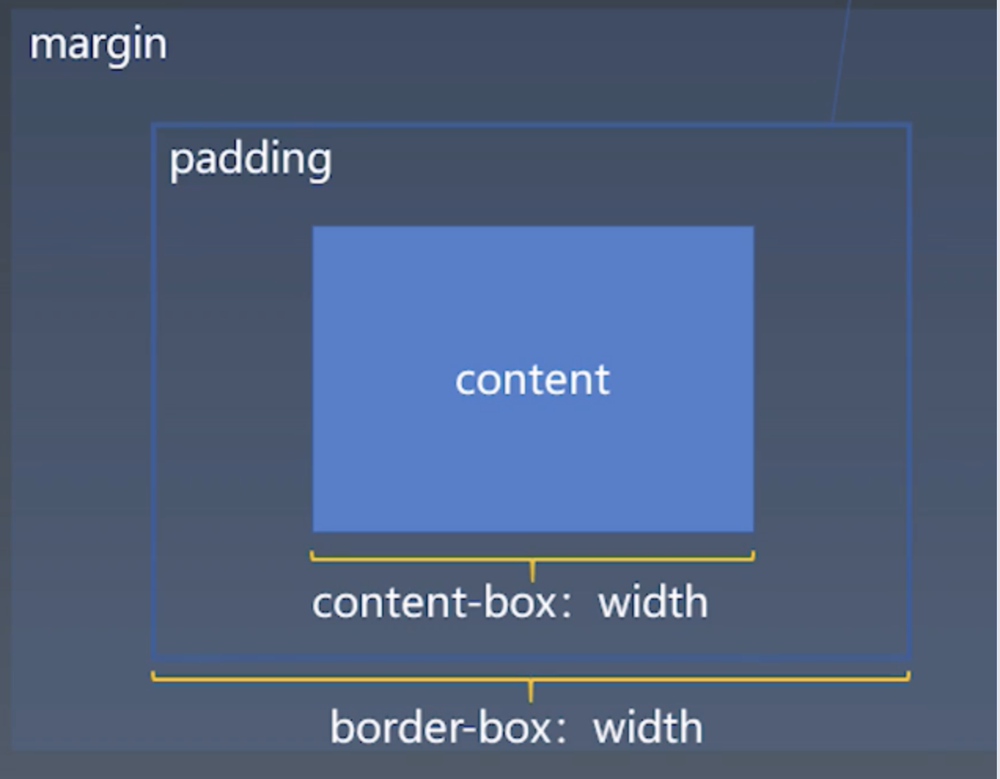

学习笔记
## 重学CSS
### CSS排版
### 一、盒（box）

> Tag标签 - 元素Element - 盒Box

1、一些概念：
1. HTML代码中可以书写开始__标签__，结束__标签__ ，和自封闭__标签__ 。
    * 标签：源代码概念
2. 一对起止_tag标签___ ，表示一个_element元素___ 。
    * 元素：语义领域概念
3. DOM树中存储的是__元素__和其它类型的节点（Node）。
    * DOM 树中存储的是节点 Node，元素是节点的一种
4. CSS选择器选中的是_元素 或 伪元素___ 。
5. CSS选择器选中的__元素__ ，在排版时可能产生多个__盒box__ 。
    * 不一定是一一对应关系，可一对多
6. 排版和渲染的基本单位是__盒__ 。

2、盒模型
> 多层结构
> padding: 内边距。决定了 content 区域的大小
> margin: 决定了盒周围空白区域大小

box-sizing
* content-box: 标准盒模型 width = content
* border-box: IE模型 width = content + padding + border


### 二、正常流
> CSS 排版技术：
> 1. 正常流：机制复杂，能力最差
> 2. flex
> 3. grid
> 4. CSS Houdini: 可 js 干预

>> 所谓排版，就是把盒安排在正确的位置，把文字安排在正确的位置

### 1、正常流排版 - 步骤
1. 收集**盒**进行(hang)
2. 计算盒在行中的排布
3. 计算行的排布

#### 2. 正常流的 - 行级排布
#### 2.1 基线对齐->Baseline
各国文字的对齐方式不一样

> FreeType：C++ 底层库
> 
> * origin: 基线坐标
> * bearing: 默认字间距
> * advance: 文字占的整个空间

#### 2.2 行模型（5条线）（位置：sub sup）
1. line-top：行高大于字体高度时出现。
2. text-top
3. base-line
4. text-bottom
5. line-bottom

* 只要字体大小不变，text-top text-bottom 也不变；多种不同字体混排，由 fontSize 最大字体决定
* 文字和盒混排：line-top/bottom 偏移
  * 盒子的先后顺序、尺寸，都会影响偏移
  * 盒子不会影响 text-top/bottom


行内盒 inline-block 的基线是随文字变化的，不建议使用基线对齐
 * 可以使用 vertical-align: top/middle/bottom/text-top/text-bottom 调整对齐
 * vertical-align 对行高影响很大


#### 3. 正常流的 - 块级排布
#### 3.1 机制

1. float 与 clear 机制

float
* 脱离正常流
* 会影响生成的 行盒 的尺寸
* 能浮动的位置受上一个元素的影响

clear: left/right
* 找一个干净的空间来执行浮动（说清除浮动并不贴切）

2. Margin Collapse 折叠
> 溯源：在印刷行业的排版体系里，任何元素的 margin 只是要求周围有空白，而不会要求跟别的边距有空白。只要周围留白空间足够，就符合排版要求。

* 只会发生在**同一个** BFC 里

### 三、 BFC 合并
#### 4.1 Block
1. Block Container: （CSS2.1） **里面有 BFC 的**
    * 能容纳正常流的盒，里面有 BFC
    * 所有能够容纳 里面不是特殊的 display 的模式的，默认里面都是正常流

  里面都是正常流：
  > * block
  > * inline-block
  > * table-cell：table-row 不是正常流
  > * flex item: display: flex 不是正常流，但是子元素 flex item 如果没有特殊的 display，是正常流
  > * grid cell
  > * table-caption：表格标题

2. Block-level Box: **外面有 BFC 的**
    * 就是能把盒放进 BEF

3. Block Box = Block Container + Block-level Box: **里外都有 BRF 的**


#### 4.2 设立 BFC
4大类
* floats: 浮动的元素，里面是正常流，会创建 BFC
* absolutely positioned elements: 绝对定位元素
* block containers(such as inline-block, table-cell, table-captions, flex items, grid cell)
* overflow、visible

另一种记法：block box && overflow: visible  
**默认能容纳正常流的盒，都认为会创建BFC，除了 block box 里外都是 BFC，并且 overflow 是 visible**（相当于没有BFC，所以会发生 BFC 合并）

**BFC 合并后的影响：**
1. float: 
    * 如果 block box 的 overflow !== visible，则创建独立 BFC，是整个 block box 放进 BFC，则整个 block box 受 BFC 影响；
    * 如果不创建 BFC，则 block box 里面的行盒受 float 影响。

2. 没有创建 BFC，存在**同向**边距折叠


### 四、flex排版

因为 flex 可以调整排布方向，所以从主轴/交叉轴方向描述
1. 收集**盒**进行(hang)
2. 计算盒在**主轴方向**的排布
3. 计算盒在**交叉轴方向**的排布

#### 1、分行
* 根据主轴尺寸，把元素分进 行
* 如果设置了 no-wrap 强行不换行

#### 2、计算主轴方向
1. 找出所有 flex 元素
2. 把主轴方向的剩余尺寸按比例分配给这些元素
3. 若剩余空间为负数，所有 flex 元素为0，等比压缩剩余元素

#### 3、计算交叉轴方向
1. 根据每一行中**最大元素尺寸**计算行高
2. 根据行高 flex-align(每个元素上的属性)、item-align(外部容器上的属性)，确定元素具体位置。（讲课中提到的flex-align 和 item-align 存疑）


### 五、CSS动画与绘制
> css 控制表现:
> 1. 控制元素位置和尺寸信息
> 2. 控制绘制和渲染信息
> 3. 控制交互与动画信息

#### 1、动画
##### 1.1 Animation
1. @keyframes 定义动画的关键帧
2. animation 调用 
```
@keyframes mykf {
    from { background: red; }
    to { background: yellow; }
}
div {
    animation: mykf 5s infinite;
}
```

**animation 6个属性:**
* animation-name 时间曲线 keyframes
* animation-duration 动画时长
* animation-timing-function 动画的时间曲线
* animation-delay 动画开始前的延迟
* animation-iteration-count 播放次数
* animation-direction 方向

##### 1.2 Transition
* transition-property 要变换的属性
* transition-duration 变换的时长
* transition-timing-function 时间曲线（三次贝塞尔曲线）
    * ease 从动到静止缓冲动画
    * linear 直线
    * ease-in 缓动启动 退出动画
    * ease-out 出现动画
    
* transition-delay 延迟


#### 2、颜色 
CMYK 与 RGB  
HSL  与 HSV 

#### 3、绘制
> 图形绘制，依赖图形库: 手机-依赖 Skia图形库；windows GDI版本；更底层的依赖**Shader**绘制

##### 3.1 几何图形
* border
* box-shadow
* border-radius

##### 3.2 文字
* font
* text-decoration
##### 3.3 位图
* background-image

应用技巧
* data uri + svg

layout render的下一层
