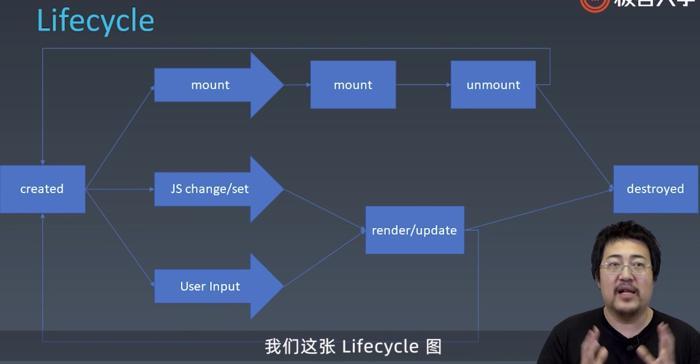

#### 前端架构两大热门话题：组件化、架构模式  
1. 组件化：从怎么扩展 HTML 引申出的前端架构体系。目标是复用
2. 架构模式：关心前端跟数据逻辑层之间的交互。（MVC MVVM）
> 组件化直接决定前端团队的复用率

#### 组件基本概念
组件区别于模块，区别于对象.  
组件：既是对象又是模块。  
    * 特点：以树形结构进行组合，并具有模板化配置的能力。

### 一、对象与组件
1、对象
* Properties 属性
* Methods 方法
* Inherit 继承关系

2、组件
* Properties：强调从属关系
* Methods
* Inherit
* Attribute 强调描述性。特性：声明型语言 markup language
* Config & State 配置&状态
* Event
* Lifecycle：声明周期 created

* Children
    * Content
    * Template 模板

### 二、JSX
语言扩展

构建组件
1. npm init
2. npm install -g webpack webpack-cli
3. npm install -save-dev webpack babel-loader
4. npm install --save-dev @babel/core @babel/preset-env
5. npm install -save-dev @babel/plugin-transform-react-jsx
6. npm install webpack-dev-server --save-dev
7. npm install --save-dev webpack-cli

